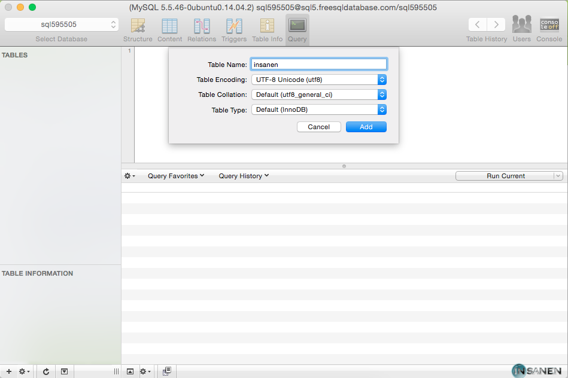
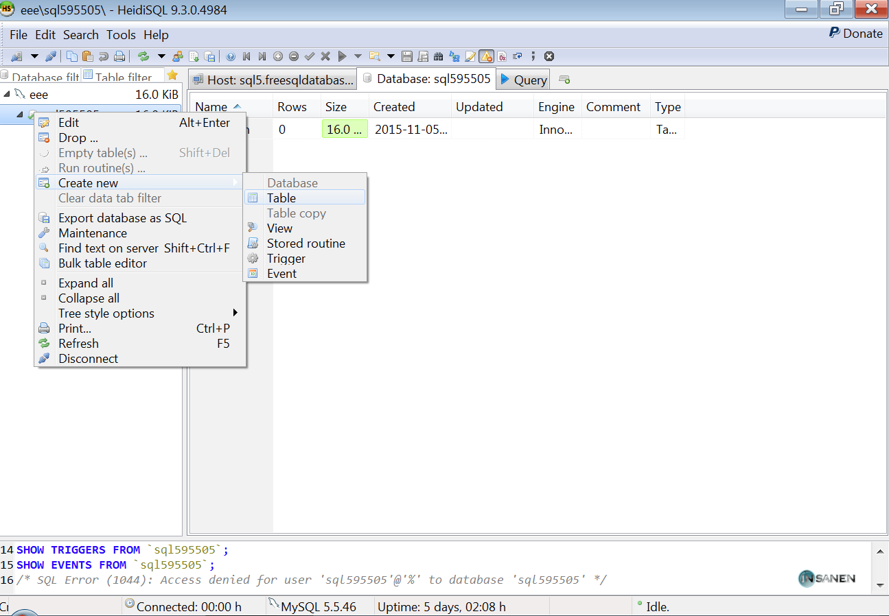

# How to remotely connect to a database :floppy_disk:
###### Using Sequel Pro for Mac or HeideiSQL for OS.
---

###### :bowtie: Before we start,

* For this read up, Im using a test database, hosted by (http://freesqldatabase.com)
* Please go ahead and Register an account with them, or have an available MySql database connection that you can access to test this out.
* You'll learn two fast and easy ways to connect to your database for easy management, but remember cmd line will always be a great skill to preserve.

### SequelPro for Mac Os

* Start by downloading Sequel Pro from http://www.sequelpro.com/download
* Open .DMG and follow installation wizard, After installation proceed to open Sequel Pro.

Let's start, After loading up the application, Start filling up with the information from your server
provider, For this example, We will be using a non-prod db.

1. Host: `sql5.freesqldatabase.com`
2. Username: `sql595505`
3. Password: `Request Password` Click Here
4. Database: `sql595505`
5. Port: `3306` (Default Port)

After writing down the information, We are going to start by testing the database connection, before we hit connect.
[ We do this to double check, sometimes we happen to make mistakes and type the wrong password. Please always double-check. ]

After the process is done, You should see a `connection succeed` message. In the case this is not your outcome, Please make sure you have the right credentials.

Now, its time to connect to the database by Clicking, `Connect` .... After a couple of minutes, We have successfully login to our database now, We recommend you to start playing with the software around and find out how easy it can be to create, edit, delete and duplicate records, as well as users and group grants.

Here is something to start playing with, on the Left Bottom Corner, there is a `+` Please go ahead and click this.

This will pull down an alert box for your new table creation, Go ahead and fill it up with your table name, and collation, for mine. I will be using table name `insanen` and Table Collation `UTF-8`.

Click `Add`

Happy Coding :metal:

-----

* Start by downloading HeidiSQL from http://www.heidisql.com/download.php
* Open .EXE and follow Installation Wizard, After installation, proceed to open HeidiSQL.

Let's start, After loading up the application, We will see a welcome message with the import settings capability, Unfortunately we do not have any backup session connections, so we are going to start a `New` one.

1. Host: `sql5.freesqldatabase.com`
2. Username: `sql595505`
3. Password: `Request Password` Click Here
4. Database: `sql595505`
5. Port: `3306` (Default Port)

After writing down the information, We are going to start by clicking `Open`

`Settings for "Unnamed" were changed. YES? or NO?`. Please click `"Yes"` and proceed.

After a couple of minutes, We have successfully login to our database, We recommend you to start playing with the software around and find out how easy it can be to create, edit, delete and duplicate records, as well as users and group grants.

Let's create an extra table, with this single steps, Click on your Database Name (`sql595505`) to expand.

After expanding this section, We will be able to see the existing tables. we have created on the past. EX) `insanen`

Right Click on your DB Name and Select `Create New` -> `Table`

After the selection is done, a new page will pop-up with information to be filled.

We are going to input for the Name `HeidiSQL` which is the name i want for my new table, To be able to insert a row inside of our table we are going to click `+ Add` and fill the information.

When your ready to save proceed to click save,

Happy Coding :metal:

##### Next Chapter: We will learn how to setup an Ubuntu Machine and CentOS Machine with a LAMP stack deployment, and phpMyAdmin for easier database access...
Stay tuned -MrZ
